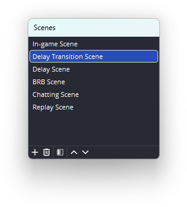
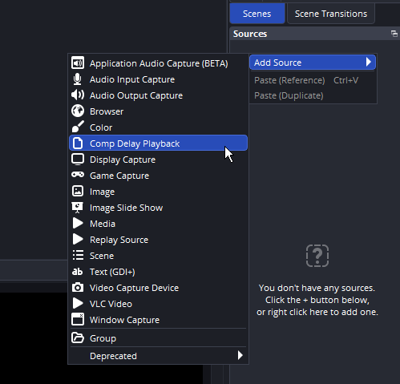
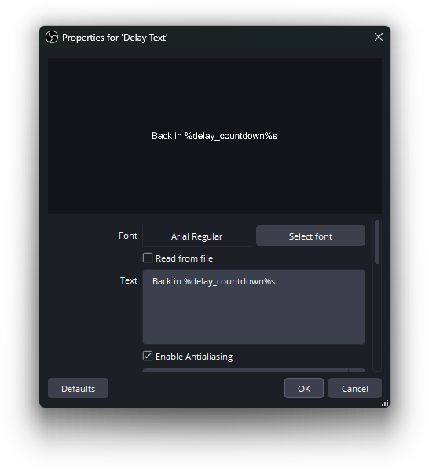
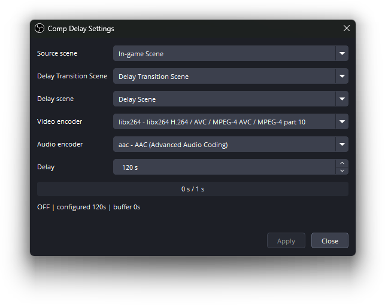
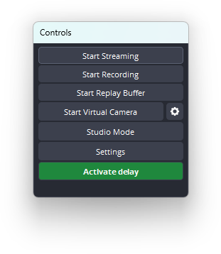

# OBS Comp Delay

OBS Comp Delay is a Windows-first OBS Studio plugin for adding stream delay while OBS keeps streaming.

It is built for live productions where you may need to protect a game, event, or competition from stream sniping without stopping the broadcast.

## What It Does

- Adds up to `300` seconds of delay.
- Keeps OBS streaming output running.
- Delays one selected source scene.
- Shows a live transition scene while the delay buffer fills.
- Switches automatically to delayed playback when the configured delay is ready.
- Adds an `Activate delay` / `Deactivate delay` button to OBS' `Controls` dock.
- Lets you choose the available video and audio encoders on your computer.
- Supports a countdown token for OBS text sources: `%delay_countdown%`.

## How It Works

You already have a normal OBS scene that contains the content you want to stream, for example your game or production feed. In OBS Comp Delay, this is your `Source scene`.

When you click `Activate delay`, OBS switches to `Delay Transition Scene` immediately. Viewers see that scene live while the plugin fills the delay buffer.

When the configured delay time has passed and the buffer is ready, OBS switches to your delay scene. That scene contains the `Comp Delay Playback` source, which plays the delayed version of your source scene.

When you click `Deactivate delay`, the plugin can either return live immediately or wait until the current delay has passed.

## Install

1. Open the [GitHub Releases page](https://github.com/ne0lines/obs-comp-delay/releases).
2. Download the latest Windows setup file:
   `obs-comp-delay-<version>-windows-x64-setup.exe`
3. Close OBS Studio.
4. Run the setup file.
5. Start OBS Studio again.

The installer places the plugin in the normal OBS Studio plugin folders.

## Setup Guide

### 1. Install the plugin and restart OBS


### 2. Create the scenes 'Delay Transition Scene' and 'Delay Scene'



### 3. Add the source 'Comp Delay Playback' to the 'Delay Scene' you created in step 2



### 4. Add a 'Text (GDI+) Source' to the 'Delay Transition Scene' you created in step 2 and insert the text "Back in %delay_countdown%s"



### 5. Go to the menu Tools -> Comp Delay Settings to select your scenes and specify the length of your delay



### 6. Click the button 'Activate delay' in the Controls dock to activate.



## How To Use

1. Set the delay in `Comp Delay Settings`.
2. Click `Apply` if needed.
3. Click `Activate delay` in OBS' `Controls` dock, or use the hotkey.
4. OBS switches to `Delay Transition Scene` immediately.
5. When the delay buffer is ready, OBS switches to `Delay scene` automatically.
6. Click `Deactivate delay` when you want to return live.
7. Choose `Deactivate now`, `Deactivate after XXs`, or `Cancel`.

The Controls button is green when delay is inactive and red when delay is active.

## Countdown Text

The countdown works in normal OBS text sources inside `Delay Transition Scene`.

Use this text:

```text
Back in %delay_countdown%
```

While the transition scene is active, the plugin replaces `%delay_countdown%` with the remaining buffer-fill time in whole seconds.

When the countdown reaches zero, the plugin keeps the text blank for about five seconds before restoring the original template. This prevents viewers from briefly seeing the raw `%delay_countdown%` token.

## Hotkeys

OBS Comp Delay adds these hotkeys:

- `Comp Delay: Activate delay`
- `Comp Delay: Deactivate delay`
- `Comp Delay: Deactivate after delay`

You can configure them in OBS' normal hotkey settings.

## Important Notes

- The plugin delays the selected source scene, not every arbitrary OBS source.
- Any audio that should be delayed must be part of, or routed into, the selected source scene.
- The source scene must not be the same as the transition scene or delay scene.
- The source scene must not contain the `Comp Delay Playback` source.
- V1 is Windows-first.

## FAQ

### Does This Stop Or Restart My Stream?

No. OBS streaming output stays active while the plugin changes scenes and fills the delay buffer.

### Why Do I Need A Delay Scene?

OBS needs a scene that contains the `Comp Delay Playback` source. That source shows and plays the delayed buffer.

### Why Do I Need A Delay Transition Scene?

`Delay Transition Scene` gives viewers something live to see while the delay buffer is filling.

### What Is The Difference Between Deactivate Now And Deactivate After XXs?

`Deactivate now` drops the delay buffer immediately and returns to the source scene live. Viewers will miss the latest delayed seconds.

`Deactivate after XXs` waits until the current configured delay has passed, then returns live.

### Can I Change The Delay While It Is Active?

Yes. Change the value in `Comp Delay Settings` and click `Apply`. The plugin uses `Delay Transition Scene` while it adjusts the buffer.

### Does Manually Switching To Delay Transition Scene Start Delay?

No. Delay starts from 'Activate delay'-button, because the plugin also has to start capture and fill the encoded buffer.

### What Happens If The Buffer Fails Or A Scene Is Missing?

The plugin falls back to `Delay Transition Scene` and shows the error in `Comp Delay Settings`.

### Does `%delay_countdown%` Work In Every Source Type?

It is intended for OBS text sources in `Delay Transition Scene`.

### Is This Cross-platform?

V1 is Windows-first.
